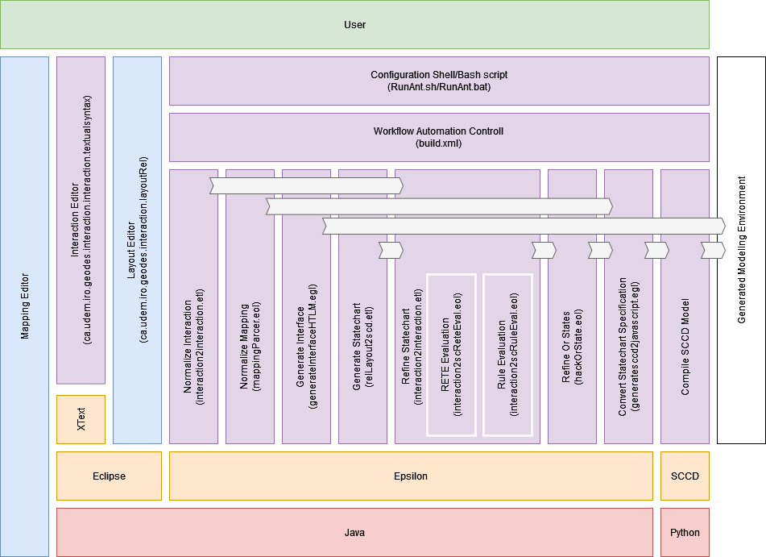

# Modeling IDE Automated Synthesis

## **Dependencies**

## 1. Java

Java is required to run both Epsilon and if needed Eclipse instances.

## 2. Python

Python is required to install and use the SCCD compiler.

## 3. Epsilon

The inclusion of **epsilon-1.5.1-kitchensink.jar** allows for the execution of Epsilon code outside of Eclipse and as a Java comand line application through ANT.

## 4. Find and replace

**fnr.exe** is an application that allows comand line specification of find and replace tasks in windows producing an equivalent result as the command **sed -i** in linux.

## 5. ANT

A task scripting utility that in conjunction with **epsilon-1.5.1-kitchensink.jar** allows fro the scripted execution of Epsilon code from the command line.

## 6. SCCD compiler

A Stachart implementation that combines with Class Diagrams, it takes as an imput an XML file and can compile it to either Python os JavaScript code that executes said Statechart.
It requires Python to be installed and executed.

## **Implementation documentation**

## 1. Launcher

There are two available launchers, **Run.bat** and **Run. sh** that launch the generation process in windows and linux respectavly.
Run.bat looks for missing dependancies and uses a local portable version if they are not already defined.
Both take as an input parameters **--Project \<name\>** to specify the name of the project. Any other parameters are passed along to the ANT script as parameters. 

## 2. ANT

The ANT file build.xml has the configuration of execution of all the sub tasks of the generation process and some additional support tasks.
The ANT file is organized by tasks, staring with the declaration of metamodel and initial file dependencies, followed by the diferent steps of generation in sequence.
Aditional support tasks include, the calculation of execution statistics, the generation of a Mermaid representation of the statechart for debug and documentation, and two lecels of project cleanup.

## 3. Generate Interaction

The file **interaction2interaction.etl** transforms an interaction model from the format produced by the XText editor available into the model format used internaly by the generation process.
It declarativly converts the editor specific elements of the interation model into their more generic form.

The file **interactionParser.eol** parces the compact text form of interaction rule specification into the model format used internaly by the generation process.
Each line is an interaction, that is split by **#** into the diferent interaction blocks. it then processes the interaction in the order, **NAME**, **BLOCK**, **TRANSITION**, repeating **BLOCK** and **TRANSITION** in alternation until all tokens are processed.
**BLOCK** is further slit into its inner elements.

## 4. Generate Mapping

The file **mappingParser.eol** parces the compact text form of mapping specification into the model format used internaly by the generation process.
Each line is a mapping, that is split by **#** into three blocks, an identifier, the event or operation being mapped, and the code snipet that resolves the mapping.
Depending on the identifier, a diferent function is called that processes the diferent types of mapping acordingly.

**OutputEventMapping(events,code)** mapps an Editor output event to a platform snipet, checking is the Editor output event already exists, to efectivly create a 1..n mapping if it does.

**LanguageEventMapping(event,code)** checks for the operations that can be performed on a language element and creates a mapping acordingly.

**ControllMapping(event,code)** checks for a general dependency code snipet and if it should be placed before, after, or used as the seperator os all remaining mappings.

## 5. Interface Gen

The file **generateInterfaceHtml.egl** generates amd html file representative of the screen interaction strean editor interface.
Additional interaction streams will require their own specific template (e.g. generating the element configuration of an arduino).
It is an HTML template containg all the common code of any editor, including a baseline set of CSS attributes.

It then generates a CSS attribute per layer to define their **z-index:** acording to that layer's index.

In the HTML body it populates the contents of the Layout model starting from the layers, and preserving the defined hierarchy.
For each possible Layout element, there is a corresponding HTML snipet that links to its CSS class and is further populated by its contained elements.

## 6. Generate Statechart

The file **relLayout2scd.etl** 

(**layout2sccd.etl** is not currently in use)

## 7. Refine Statechart

The file **interaction2sccd4.eol** refines the Statechart with the interaction information defined in the Interaction model.
It depends on two additional files.

In **Setup** it initializes all the internal variables used during the refinement process, including **controll** an instance of the Controll metamodel that includes the specification of the RETENetwork, the token configuration, the processing queues and remaining complex data used in the refinement process.
This allows for the optional serialization of this data for debugging purposes.

In **Build** the RETE Network is built according to the dependencies defined in the Interaction model.

In **Init** the RETE Network is initialized to its starting values acording to the Layout model information, as enbeded in the Statechart.

**Exec** is the core of the process step, where the RETE Network is evaluated and subsequent refinements applied.
It is here that the modules that evaluate the RETE Network and rule refinement are called.

**Find as Par** is a series of functions that search for parameter reference of any given Layout element as to correctly locate the relevant Statechart state.

**Debug** is a generic debugging function that outputs the state of the queue, providing a runtime trace of the refinement process.

### 7.1. RETE Network

The file **interaction2scReteEval.eol** takes the previous token configuration of the network and the lists of freshly changed Alpha nodes and propagate their tokan value changes antil it has the list of active Beta nodes.
From the list of Beta nodes, it returns the list of applicable rules to this configuration.

### 7.2. Rule Refinement

The file **interaction2scRuleEval.eol**

## 8. Refactor SC

The file **hackOrState.eol** refactors the transitions to or from OR states into the equivalent set of transitions to and from that OR state's inner states.

## 9. Synthetise SCCD

The file **generatescc2javascript.egl**

## 10. Compiele SCCD

This step of the ANT configuration calls the SCCD compiler to generate a JS version of the statchart that can be included in the interface HTML

## 11. SCCD cleanup

Due to issues with compiling the SCCD statechart, all logical-AND operations are kept as **and** until the compilation of the SCCD, and in this step they are finaly converted to **&&** as expected by JavaScript.

For this a simple string replacement operation is performed. In Linux this utilizes the native shell operations for this effect. In Windows a find and replace application (fnr.exe) is supplied with the remaining software.

## 12. Generate Mermaid Documentation

The file **generatesccd2mermaid.egl** is similar to the conversion of the internal SC into SCCD, in how it navigates the Statechart.
But instead of generating a new statechart with the mapping details refined into it and the contextual information of the layout removed, it simply generates a visual representation of the Statechart in Mermaid.

and text here 
