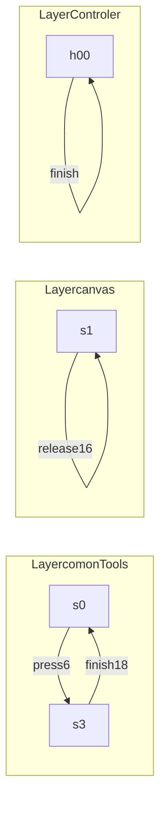

```mermaid
graph LR
    
    subgraph LayercomonTools
        s0 -- "press6" --> s3
        s3 -- "finish18" --> s0
        
    end
    subgraph Layercanvas
        s1 -- "select0" --> s1
        s1 -- "place2" --> s1
        s1 -- "place4" --> s1
        s1 -- "select8" --> s1
        s1 -- "release10" --> s1
        s1 -- "release12" --> s1
        s1 -- "release14" --> s1
        s1 -- "release16" --> s1
        
    end
    subgraph LayerControler
        h00 -- "select" --> h00
        h00 -- "place" --> h00
        h00 -- "place" --> h00
        h00 -- "press" --> h00
        h00 -- "select" --> h00
        h00 -- "release" --> h00
        h00 -- "release" --> h00
        h00 -- "release" --> h00
        h00 -- "release" --> h00
        h00 -- "finish" --> h00
        
    end
    
```

