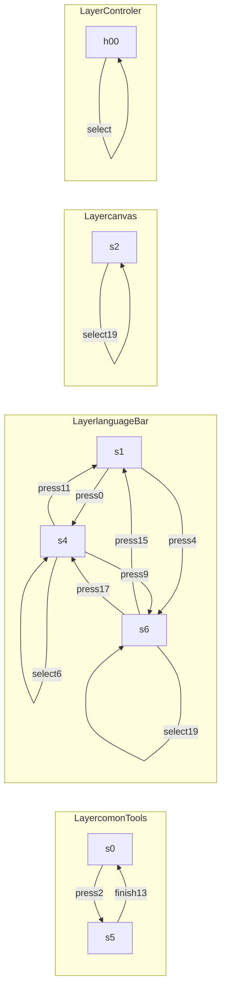

```mermaid
graph LR
    
    subgraph LayercomonTools
        s0 -- "press2" --> s5
        s5 -- "finish13" --> s0
        
    end
    subgraph LayerlanguageBar
        s1 -- "press0" --> s4
        s1 -- "press4" --> s6
        s4 -- "select6" --> s4
        s4 -- "press9" --> s6
        s4 -- "press11" --> s1
        s6 -- "press15" --> s1
        s6 -- "press17" --> s4
        s6 -- "select19" --> s6
        
    end
    subgraph Layercanvas
        s2 -- "select6" --> s2
        s2 -- "select19" --> s2
        
    end
    subgraph LayerControler
        h00 -- "press" --> h00
        h00 -- "press" --> h00
        h00 -- "press" --> h00
        h00 -- "select" --> h00
        h00 -- "press" --> h00
        h00 -- "press" --> h00
        h00 -- "finish" --> h00
        h00 -- "press" --> h00
        h00 -- "press" --> h00
        h00 -- "select" --> h00
        
    end
    
```

