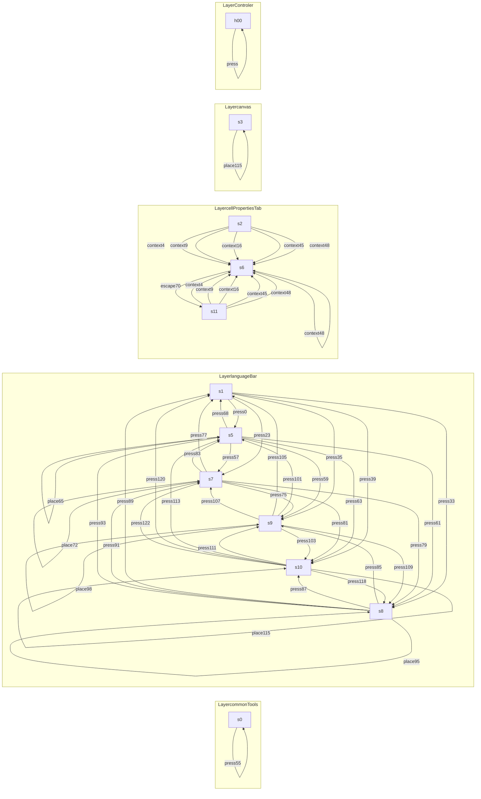

```mermaid
graph LR
    
    subgraph LayercommonTools
        s0 -- "press55" --> s0
        
    end
    subgraph LayerlanguageBar
        s1 -- "press0" --> s5
        s1 -- "press23" --> s7
        s1 -- "press33" --> s8
        s1 -- "press35" --> s9
        s1 -- "press39" --> s10
        s5 -- "press57" --> s7
        s5 -- "press59" --> s9
        s5 -- "press61" --> s8
        s5 -- "press63" --> s10
        s5 -- "place65" --> s5
        s5 -- "press68" --> s1
        s7 -- "place72" --> s7
        s7 -- "press75" --> s9
        s7 -- "press77" --> s1
        s7 -- "press79" --> s8
        s7 -- "press81" --> s10
        s7 -- "press83" --> s5
        s8 -- "press85" --> s9
        s8 -- "press87" --> s10
        s8 -- "press89" --> s1
        s8 -- "press91" --> s7
        s8 -- "press93" --> s5
        s8 -- "place95" --> s8
        s9 -- "place98" --> s9
        s9 -- "press101" --> s5
        s9 -- "press103" --> s10
        s9 -- "press105" --> s1
        s9 -- "press107" --> s7
        s9 -- "press109" --> s8
        s10 -- "press111" --> s9
        s10 -- "press113" --> s5
        s10 -- "place115" --> s10
        s10 -- "press118" --> s8
        s10 -- "press120" --> s1
        s10 -- "press122" --> s7
        
    end
    subgraph LayercellPropertiesTab
        s2 -- "context4" --> s6
        s2 -- "context9" --> s6
        s2 -- "context16" --> s6
        s2 -- "context45" --> s6
        s2 -- "context48" --> s6
        s6 -- "escape70" --> s11
        s6 -- "context4" --> s6
        s6 -- "context9" --> s6
        s6 -- "context16" --> s6
        s6 -- "context45" --> s6
        s6 -- "context48" --> s6
        s11 -- "context4" --> s6
        s11 -- "context9" --> s6
        s11 -- "context16" --> s6
        s11 -- "context45" --> s6
        s11 -- "context48" --> s6
        
    end
    subgraph Layercanvas
        s3 -- "mark2" --> s3
        s3 -- "context4" --> s3
        s3 -- "remove7" --> s3
        s3 -- "context9" --> s3
        s3 -- "move12" --> s3
        s3 -- "remove14" --> s3
        s3 -- "context16" --> s3
        s3 -- "remove19" --> s3
        s3 -- "move21" --> s3
        s3 -- "mark25" --> s3
        s3 -- "mark27" --> s3
        s3 -- "remove29" --> s3
        s3 -- "mark31" --> s3
        s3 -- "mark37" --> s3
        s3 -- "remove41" --> s3
        s3 -- "move43" --> s3
        s3 -- "context45" --> s3
        s3 -- "context48" --> s3
        s3 -- "move51" --> s3
        s3 -- "move53" --> s3
        s3 -- "place65" --> s3
        s3 -- "place72" --> s3
        s3 -- "place95" --> s3
        s3 -- "place98" --> s3
        s3 -- "place115" --> s3
        
    end
    subgraph LayerControler
        h00 -- "press" --> h00
        h00 -- "mark" --> h00
        h00 -- "context" --> h00
        h00 -- "remove" --> h00
        h00 -- "context" --> h00
        h00 -- "move" --> h00
        h00 -- "remove" --> h00
        h00 -- "context" --> h00
        h00 -- "remove" --> h00
        h00 -- "move" --> h00
        h00 -- "press" --> h00
        h00 -- "mark" --> h00
        h00 -- "mark" --> h00
        h00 -- "remove" --> h00
        h00 -- "mark" --> h00
        h00 -- "press" --> h00
        h00 -- "press" --> h00
        h00 -- "mark" --> h00
        h00 -- "press" --> h00
        h00 -- "remove" --> h00
        h00 -- "move" --> h00
        h00 -- "context" --> h00
        h00 -- "context" --> h00
        h00 -- "move" --> h00
        h00 -- "move" --> h00
        h00 -- "press" --> h00
        h00 -- "press" --> h00
        h00 -- "press" --> h00
        h00 -- "press" --> h00
        h00 -- "press" --> h00
        h00 -- "place" --> h00
        h00 -- "press" --> h00
        h00 -- "escape" --> h00
        h00 -- "place" --> h00
        h00 -- "press" --> h00
        h00 -- "press" --> h00
        h00 -- "press" --> h00
        h00 -- "press" --> h00
        h00 -- "press" --> h00
        h00 -- "press" --> h00
        h00 -- "press" --> h00
        h00 -- "press" --> h00
        h00 -- "press" --> h00
        h00 -- "press" --> h00
        h00 -- "place" --> h00
        h00 -- "place" --> h00
        h00 -- "press" --> h00
        h00 -- "press" --> h00
        h00 -- "press" --> h00
        h00 -- "press" --> h00
        h00 -- "press" --> h00
        h00 -- "press" --> h00
        h00 -- "press" --> h00
        h00 -- "place" --> h00
        h00 -- "press" --> h00
        h00 -- "press" --> h00
        h00 -- "press" --> h00
        
    end
    
```

