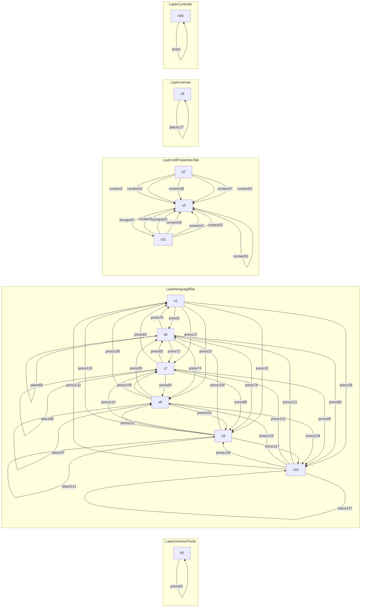

```mermaid
graph LR
    
    subgraph LayercommonTools
        s0 -- "press65" --> s0
        
    end
    subgraph LayerlanguageBar
        s1 -- "press5" --> s6
        s1 -- "press13" --> s7
        s1 -- "press23" --> s8
        s1 -- "press32" --> s9
        s1 -- "press36" --> s10
        s6 -- "place69" --> s6
        s6 -- "press72" --> s7
        s6 -- "press74" --> s8
        s6 -- "press76" --> s1
        s6 -- "press78" --> s9
        s6 -- "press80" --> s10
        s7 -- "press82" --> s6
        s7 -- "press84" --> s8
        s7 -- "press86" --> s9
        s7 -- "press88" --> s10
        s7 -- "place90" --> s7
        s7 -- "press93" --> s1
        s8 -- "press95" --> s6
        s8 -- "place97" --> s8
        s8 -- "press100" --> s7
        s8 -- "press102" --> s9
        s8 -- "press104" --> s10
        s8 -- "press106" --> s1
        s9 -- "press108" --> s6
        s9 -- "press110" --> s7
        s9 -- "press112" --> s8
        s9 -- "place114" --> s9
        s9 -- "press117" --> s10
        s9 -- "press119" --> s1
        s10 -- "press121" --> s6
        s10 -- "press123" --> s7
        s10 -- "press125" --> s8
        s10 -- "place127" --> s10
        s10 -- "press130" --> s9
        s10 -- "press132" --> s1
        
    end
    subgraph LayercellPropertiesTab
        s2 -- "context2" --> s5
        s2 -- "context29" --> s5
        s2 -- "context38" --> s5
        s2 -- "context47" --> s5
        s2 -- "context52" --> s5
        s5 -- "escape67" --> s11
        s5 -- "context2" --> s5
        s5 -- "context29" --> s5
        s5 -- "context38" --> s5
        s5 -- "context47" --> s5
        s5 -- "context52" --> s5
        s11 -- "context2" --> s5
        s11 -- "context29" --> s5
        s11 -- "context38" --> s5
        s11 -- "context47" --> s5
        s11 -- "context52" --> s5
        
    end
    subgraph Layercanvas
        s3 -- "move0" --> s3
        s3 -- "context2" --> s3
        s3 -- "release7" --> s3
        s3 -- "release9" --> s3
        s3 -- "remove11" --> s3
        s3 -- "release15" --> s3
        s3 -- "mark17" --> s3
        s3 -- "mark19" --> s3
        s3 -- "remove21" --> s3
        s3 -- "remove25" --> s3
        s3 -- "move27" --> s3
        s3 -- "context29" --> s3
        s3 -- "mark34" --> s3
        s3 -- "context38" --> s3
        s3 -- "mark41" --> s3
        s3 -- "remove43" --> s3
        s3 -- "move45" --> s3
        s3 -- "context47" --> s3
        s3 -- "release50" --> s3
        s3 -- "context52" --> s3
        s3 -- "release55" --> s3
        s3 -- "move57" --> s3
        s3 -- "move59" --> s3
        s3 -- "mark61" --> s3
        s3 -- "remove63" --> s3
        s3 -- "place69" --> s3
        s3 -- "place90" --> s3
        s3 -- "place97" --> s3
        s3 -- "place114" --> s3
        s3 -- "place127" --> s3
        
    end
    subgraph LayerControler
        h00 -- "move" --> h00
        h00 -- "context" --> h00
        h00 -- "press" --> h00
        h00 -- "release" --> h00
        h00 -- "release" --> h00
        h00 -- "remove" --> h00
        h00 -- "press" --> h00
        h00 -- "release" --> h00
        h00 -- "mark" --> h00
        h00 -- "mark" --> h00
        h00 -- "remove" --> h00
        h00 -- "press" --> h00
        h00 -- "remove" --> h00
        h00 -- "move" --> h00
        h00 -- "context" --> h00
        h00 -- "press" --> h00
        h00 -- "mark" --> h00
        h00 -- "press" --> h00
        h00 -- "context" --> h00
        h00 -- "mark" --> h00
        h00 -- "remove" --> h00
        h00 -- "move" --> h00
        h00 -- "context" --> h00
        h00 -- "release" --> h00
        h00 -- "context" --> h00
        h00 -- "release" --> h00
        h00 -- "move" --> h00
        h00 -- "move" --> h00
        h00 -- "mark" --> h00
        h00 -- "remove" --> h00
        h00 -- "press" --> h00
        h00 -- "escape" --> h00
        h00 -- "place" --> h00
        h00 -- "press" --> h00
        h00 -- "press" --> h00
        h00 -- "press" --> h00
        h00 -- "press" --> h00
        h00 -- "press" --> h00
        h00 -- "press" --> h00
        h00 -- "press" --> h00
        h00 -- "press" --> h00
        h00 -- "press" --> h00
        h00 -- "place" --> h00
        h00 -- "press" --> h00
        h00 -- "press" --> h00
        h00 -- "place" --> h00
        h00 -- "press" --> h00
        h00 -- "press" --> h00
        h00 -- "press" --> h00
        h00 -- "press" --> h00
        h00 -- "press" --> h00
        h00 -- "press" --> h00
        h00 -- "press" --> h00
        h00 -- "place" --> h00
        h00 -- "press" --> h00
        h00 -- "press" --> h00
        h00 -- "press" --> h00
        h00 -- "press" --> h00
        h00 -- "press" --> h00
        h00 -- "place" --> h00
        h00 -- "press" --> h00
        h00 -- "press" --> h00
        
    end
    
```

