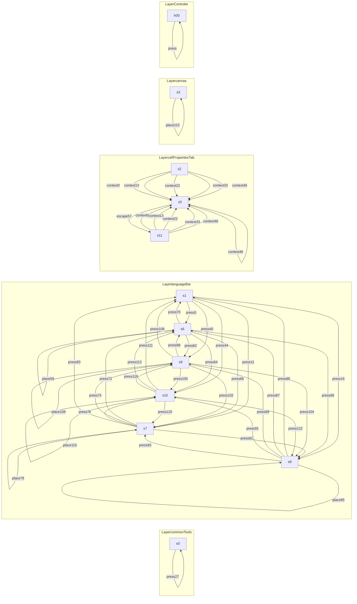

```mermaid
graph LR
    
    subgraph LayercommonTools
        s0 -- "press27" --> s0
        
    end
    subgraph LayerlanguageBar
        s1 -- "press5" --> s6
        s1 -- "press11" --> s7
        s1 -- "press16" --> s8
        s1 -- "press40" --> s9
        s1 -- "press44" --> s10
        s6 -- "place59" --> s6
        s6 -- "press62" --> s9
        s6 -- "press64" --> s10
        s6 -- "press66" --> s7
        s6 -- "press68" --> s8
        s6 -- "press70" --> s1
        s7 -- "press72" --> s6
        s7 -- "press74" --> s9
        s7 -- "press76" --> s10
        s7 -- "place78" --> s7
        s7 -- "press81" --> s8
        s7 -- "press83" --> s1
        s8 -- "press85" --> s1
        s8 -- "press87" --> s6
        s8 -- "press89" --> s9
        s8 -- "press91" --> s10
        s8 -- "press93" --> s7
        s8 -- "place95" --> s8
        s9 -- "press98" --> s6
        s9 -- "press100" --> s10
        s9 -- "press102" --> s7
        s9 -- "press104" --> s8
        s9 -- "press106" --> s1
        s9 -- "place108" --> s9
        s10 -- "press111" --> s1
        s10 -- "press113" --> s6
        s10 -- "place115" --> s10
        s10 -- "press118" --> s9
        s10 -- "press120" --> s7
        s10 -- "press122" --> s8
        
    end
    subgraph LayercellPropertiesTab
        s2 -- "context0" --> s5
        s2 -- "context13" --> s5
        s2 -- "context22" --> s5
        s2 -- "context33" --> s5
        s2 -- "context46" --> s5
        s5 -- "escape57" --> s11
        s5 -- "context0" --> s5
        s5 -- "context13" --> s5
        s5 -- "context22" --> s5
        s5 -- "context33" --> s5
        s5 -- "context46" --> s5
        s11 -- "context0" --> s5
        s11 -- "context13" --> s5
        s11 -- "context22" --> s5
        s11 -- "context33" --> s5
        s11 -- "context46" --> s5
        
    end
    subgraph Layercanvas
        s3 -- "context0" --> s3
        s3 -- "move3" --> s3
        s3 -- "move7" --> s3
        s3 -- "mark9" --> s3
        s3 -- "context13" --> s3
        s3 -- "mark18" --> s3
        s3 -- "mark20" --> s3
        s3 -- "context22" --> s3
        s3 -- "remove25" --> s3
        s3 -- "remove29" --> s3
        s3 -- "remove31" --> s3
        s3 -- "context33" --> s3
        s3 -- "move36" --> s3
        s3 -- "remove38" --> s3
        s3 -- "mark42" --> s3
        s3 -- "context46" --> s3
        s3 -- "remove49" --> s3
        s3 -- "mark51" --> s3
        s3 -- "move53" --> s3
        s3 -- "move55" --> s3
        s3 -- "place59" --> s3
        s3 -- "place78" --> s3
        s3 -- "place95" --> s3
        s3 -- "place108" --> s3
        s3 -- "place115" --> s3
        
    end
    subgraph LayerControler
        h00 -- "context" --> h00
        h00 -- "move" --> h00
        h00 -- "press" --> h00
        h00 -- "move" --> h00
        h00 -- "mark" --> h00
        h00 -- "press" --> h00
        h00 -- "context" --> h00
        h00 -- "press" --> h00
        h00 -- "mark" --> h00
        h00 -- "mark" --> h00
        h00 -- "context" --> h00
        h00 -- "remove" --> h00
        h00 -- "press" --> h00
        h00 -- "remove" --> h00
        h00 -- "remove" --> h00
        h00 -- "context" --> h00
        h00 -- "move" --> h00
        h00 -- "remove" --> h00
        h00 -- "press" --> h00
        h00 -- "mark" --> h00
        h00 -- "press" --> h00
        h00 -- "context" --> h00
        h00 -- "remove" --> h00
        h00 -- "mark" --> h00
        h00 -- "move" --> h00
        h00 -- "move" --> h00
        h00 -- "escape" --> h00
        h00 -- "place" --> h00
        h00 -- "press" --> h00
        h00 -- "press" --> h00
        h00 -- "press" --> h00
        h00 -- "press" --> h00
        h00 -- "press" --> h00
        h00 -- "press" --> h00
        h00 -- "press" --> h00
        h00 -- "press" --> h00
        h00 -- "place" --> h00
        h00 -- "press" --> h00
        h00 -- "press" --> h00
        h00 -- "press" --> h00
        h00 -- "press" --> h00
        h00 -- "press" --> h00
        h00 -- "press" --> h00
        h00 -- "press" --> h00
        h00 -- "place" --> h00
        h00 -- "press" --> h00
        h00 -- "press" --> h00
        h00 -- "press" --> h00
        h00 -- "press" --> h00
        h00 -- "press" --> h00
        h00 -- "place" --> h00
        h00 -- "press" --> h00
        h00 -- "press" --> h00
        h00 -- "place" --> h00
        h00 -- "press" --> h00
        h00 -- "press" --> h00
        h00 -- "press" --> h00
        
    end
    
```

